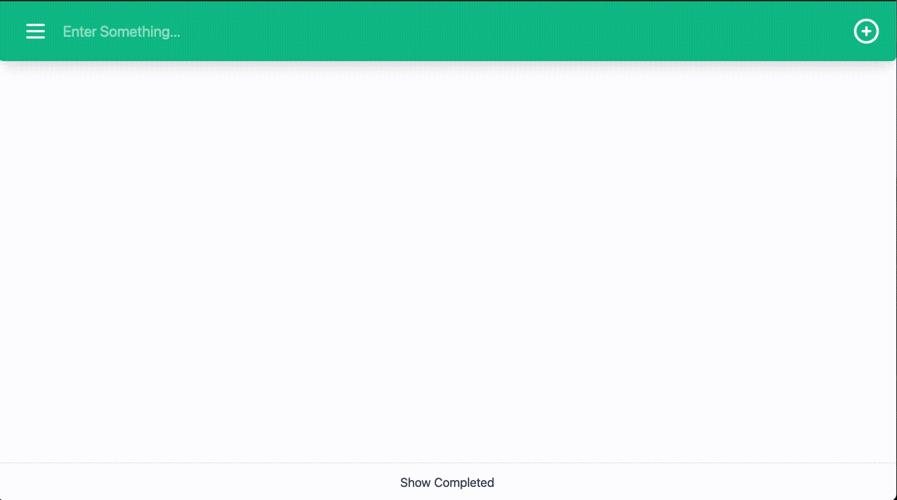

# Todo List App

Application can be found at [`todo.camway.ca`](http://todo.camway.ca)

## Behind the scenes
This application is using a frontend built in React, which is using Javascript's `fetch` API to query my Express REST API. Both of these are hosted on Heroku (which is why the application may have taken a while to load for you). The API is then querys the Postgres database which is hosted using AWS's RDS. 

## Motivation
Like all other Todo App's, this application was used to learn the basics of full stack development. I have learned a lot while developing this application. If you would like to see more of my work or see what else I have taken on since this project, see [`camway.ca`](http://camway.ca)

### Side Note
Yes, I am aware you can see the content of anyone that has used this application in the past. Could this application have been built using the browsers local storage instead of a full backend? Probably. Instead, I used this application to learn how to connect the frontend to the backend using a REST API. In the meantime, please do not put anything on this app that you do not want others to see. :)

### What's Next

I am not done with this side project, I will likely use it to learn other sides of full stack development such as testing using Jest. Another feature I hope to add is implementing user auth, which will allow me to seperate user's content. Lastly, some refactoring is in order. Specifically, the routes need seperating, and the newly added lists feature could use some cleaning up. 
